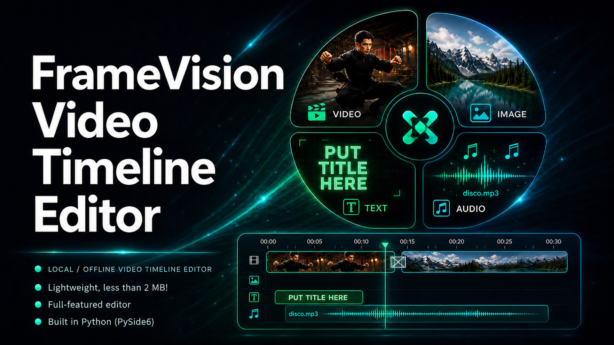
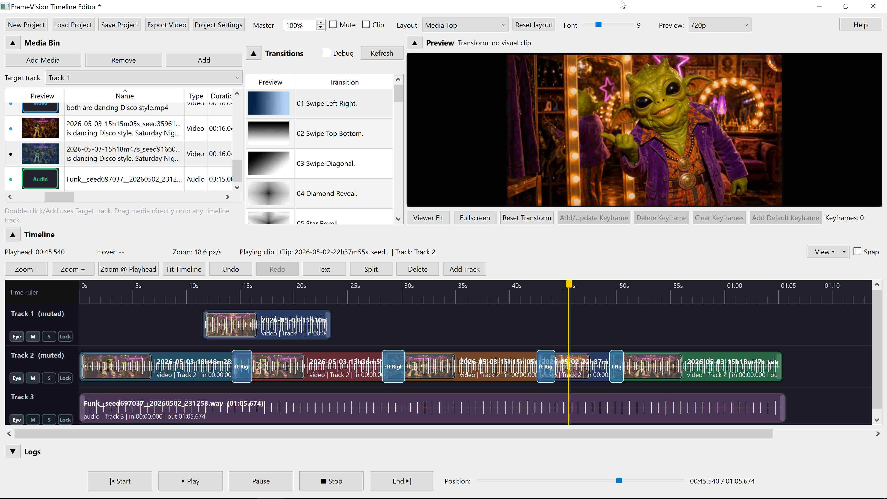

  

  

                                                FrameVision Timeline Editor

---
- A local/offline timeline editor, built with python, running in Pyside6.
- Build a video from clips, images, audio, transitions, fades, transforms and more into a final MP4 exported media file.
- Needs python, Numpy and pyside6 to run, needs ffmpeg bundle extracted in /presets/bin or /bin/ to work (maybe installer later)
- Works on CPU, no expensive GPU needed.
---
Quick Start
---
- Click Add Media to load videos, images, or audio into the Media Bin. 
- Choose the Target track or drag media directly onto the timeline. 
- Click Text on the timeline toolbar when you want to create titles, captions, credits, or animated text overlays. 
- Use Play, Pause, Stop, Start, and End at the bottom to preview your edit. 
- Drag clip edges to trim. Drag the clip body to move clips along the timeline or between tracks. 
- Overlap two visual clips and apply a transition from the Transitions panel. 
- Use right-click menus for clip options such as split, delete, speed, volume, fades, transforms,... 
- Click Export Video when the timeline looks right. 
---
Top Toolbar
---
- New Project
Starts a clean project. Use this when you want to clear the current timeline and begin again. 

- Load Project / Save Project
Loads or saves the editor project JSON. This stores the edit structure, clip placement, tracks, transitions, fades, transforms, Text clips, multi-selection state, and other project settings. It does not create the final video; use Export Video for that. 

- Autosave and Recovery
Automatic project saving helps recover work after an accidental close or crash. Autosave runs silently in the background about every 60 seconds, but only when the project has changes. 
If you are working in an already saved project JSON, autosave updates that project file. 
If the project has not been manually saved yet, autosave writes a recovery file in /temp/timeline_editor_autosave.json. 
When the editor starts and finds a recovery autosave, it asks whether to Restore, Delete, or Ignore it. 
Restore loads the recovery project and keeps it marked as unsaved, so you can review it and save it where you want. 
Delete removes the recovery file. Use this only when you are sure you do not need it. 
Ignore leaves the recovery file in place so you can decide later.
Autosave is a safety net, not a replacement for normal project saving. For important edits, still use Save Project and give the project a clear name. 
If you intentionally want to keep different versions of a project, use separate saved project files. Autosave is designed to protect the current work, not to manage version history. 

- Export Video
Creates the final MP4 from the full timeline using FFmpeg. Export is the real result, so if live preview is a bit slow around heavy transitions, check the exported MP4 before assuming the edit is broken. 

- Project Settings
Controls project canvas settings. The canvas is the final composition size used for preview and export. Use this when you want a different project format, such as landscape, portrait, or square. 

- Master Volume and Master Mute
Controls the overall audio level for the full project. Master mute silences everything without changing the individual clip or track volumes. 

- Layout and Reset Layout
Changes the workspace layout. Reset layout restores a safe default if panels become awkward after resizing. 

- Font
Changes the editor UI font size. This is useful on high-resolution screens or when the timeline gets crowded. 

- Preview Quality
Controls live preview quality only. Lower preview quality can make editing smoother. It does not reduce final export quality. 

- Text
Creates a reusable Text/Title asset and adds it to the timeline. Use this for titles, captions, lower-thirds, end credits, labels, or animated text overlays. 

- Media Bin
The Media Bin lists files that are available for your project. It shows favorites, media-type colors, preview thumbnails, display name, type, duration, and source path. 
Add Media: import video, image, audio, or Text assets. 
Preview thumbnail: shows a small preview when available. Images and Text assets can show their own preview; videos can reuse already generated timeline thumbnails. 
Colored dot: shows the media type at a glance: video, audio, image, or Text. 
Favorites: mark important media with a star. Favorites stay grouped above normal items so they are easier to find. 
Sorting: click the Media Bin column headers to sort by name, type, duration, path, or favorite state. 
Remove: remove selected files from the Media Bin. 
Add: add the selected Media Bin item to the selected Target track. 
Target track: decides where the Add button places the selected media.
You can also drag media directly from the Media Bin onto any timeline track. This is usually faster than using the Add button. 
Text assets also appear in the Media Bin as type Text. You can drag them onto the timeline like normal media. Right-click a Text asset in the Media Bin and choose Edit Text Asset to change the reusable saved text style. 
Right-click a Media Bin item for quick actions: Preview source, Add to timeline at playhead, Rename in Media Bin, Open Folder, Favorite, Remove from media bin, Media info, or Copy media info. Rename in Media Bin is editor-only: it changes the name shown in the project, but it does not rename or move the real source file. 

- Preview Pane
The Preview pane shows the current frame from the timeline or selected media. It is also used for checking visual position, scale, rotation, opacity, transitions, and fine details inside a media file. 
The Preview pane itself supports pan and zoom when the mouse is hovering over it. Use the mouse scroll wheel up/down to zoom in and out. You can zoom very far into the media, up to about 50x, and then pan around to inspect details. 
For very deep zoom levels, especially around 50x, pause video playback before zooming or panning. This avoids unnecessary preview stutter while the editor is trying to play video and redraw a heavily zoomed preview at the same time. 
Preview-related controls such as Viewer Fit, Fullscreen, Reset Transform, and visual Keyframe buttons may be shown near the preview area depending on the current layout. Use Reset Transform if a selected visual clip becomes misplaced, resized, rotated, or transparent by accident. 
The preview header can also show transform information such as X and Y position. X/Y values describe how far the selected visual clip is moved from its normal centered/default placement. A visible default-size border may be shown in the Preview pane so you can compare the current moved/scaled/rotated clip against its original/default placement. 

- Timeline Basics
The timeline is where the actual edit happens. Time runs from left to right. Tracks are stacked vertically. The playhead shows the current time. 
Zoom - / Zoom +: zoom out or in on the timeline. 
Zoom @ Playhead: zooms while keeping focus around the current playhead position. 
Fit Timeline: zooms so the project fits in view. 
Split: cuts the selected clip at the playhead. 
Delete: removes the selected clip or item. 
Add Track: creates another track. 
Snap: helps clips snap to nearby times, edges, or useful positions. 

- Bottom Playback Controls
Start: moves the playhead to the beginning of all timeline media. 
Play: plays the timeline from the current playhead position. 
Pause: pauses playback. 
Stop: stops playback. 
End: moves the playhead to the end of all timeline media. 
Position slider: scrub through the timeline. 

- Tracks
Tracks hold clips. Higher visual tracks can appear above lower visual tracks when clips overlap. Audio tracks can be muted, soloed, and mixed. 
Eye: show or hide a visual track. 
M: mute a track. 
S: solo a track. 
Lock: prevent accidental changes to that track. 

- Clip Editing
Select a clip on the timeline to edit it. Most deeper options are in the right-click menu. 
Move: drag the clip body left/right or to another compatible track. 
Trim: drag the left or right edge of a clip. 
Split: place the playhead where you want the cut and click Split. 
Copy / Paste / Duplicate: useful for repeating clips or reusing effects. 
Change Speed: changes video speed when available. 
Playback > Play backwards: reverses a video clip non-destructively. The original source file is not changed, and the clip keeps its normal place and length on the timeline. 
Detach Audio: creates an audio-only clip from a video source. 

- Multi-Selection
Multi-selection lets you select more than one timeline clip at the same time. This is useful when you want to move, delete, copy, paste, duplicate, or apply compatible operations to several clips together. 
Hold Shift and click timeline clips to add or remove them from the current selection. 
Drag selected clips to move them together while keeping their relative timing. 
Use copy, paste, duplicate, or delete when you want to work on a group instead of one clip. 
Some actions only apply to compatible clips. For example, visual transforms apply to visual clips, while audio options apply to clips with audio.
Multi-select is best for moving a whole section of an edit, deleting a group of clips, or copying a repeated layout. If an action seems unavailable, check whether the selected clips are mixed types such as video, audio, image, and Text. 

- Visual Transform Tools
Visual clips can be moved, resized, rotated, fitted, mirrored, flipped, or made transparent. These changes affect preview and export. 
Use transform controls or preview interactions to adjust a selected visual clip. 
Use Right-click visual clip > Transform for fit, fill, stretch, reset, rotation, opacity, scale, position, and manual rotation controls. 
Use Transform > Mirror / Flip to mirror a video or image horizontally, vertically, both directions, or reset the mirror state. 
Use Reset Transform if the clip becomes misplaced or you want to return to the default fit. 
Some transform actions can apply to multiple selected visual clips. 
Use clip protection when you want to preview without accidentally moving or resizing a clip.
The Preview pane can be used as a direct visual editor: select a video or image clip, move it around, resize it, rotate it, and check the live result in the viewer. The X/Y position readout helps you see exactly how far the clip has moved from default center. 
Use the default-size border as your visual anchor. It makes it much easier to create controlled zooms, pans, rotations, picture-in-picture moves, and before/after style effects without losing the original position. 

- Visual Keyframes
Visual keyframes let you animate normal video and image clips over time. A keyframe stores the selected clip's visual transform at the current playhead position: position X/Y, scale/size, rotation, opacity, and fit mode. When you add multiple keyframes on the same clip, the editor interpolates between them, creating smooth movement during playback and export. 
Select a video or image clip on the timeline. 
Move the playhead to the time where the effect should start. 
Move, resize, rotate, or adjust the clip in the Preview pane. 
Click Add/Update Keyframe to store that position. 
Move the playhead later in the clip, change the transform again, and click Add/Update Keyframe again. 
Play the clip to preview the animated movement.
Add/Update Keyframe: saves the current visual transform at the playhead. If a keyframe already exists near that time, it updates it. 
Add Default Keyframe: saves the true default placement at the playhead: X/Y 0, scale 1, rotation 0, opacity 1, fit mode fit. 
Delete Keyframe: removes the nearest transform keyframe around the current playhead position. 
Clear Keyframes: removes all visual transform keyframes from the selected clip. 
Keyframes: 0 / 1 / 2...: shows how many transform keyframes the selected visual clip currently has. 
Reset Transform: with no keyframes, resets the clip back to default. With keyframes, it can be used to store/reset the current keyframed position back to default.
Simple two-keyframe ideas are often enough: start normal, then slowly zoom in; start left, then move right; start small, then grow full screen; or rotate slightly during a beat/drop. 
Keyframes are based on the selected clip and the current playhead position inside that clip. If a keyframe button seems to do nothing, check that a video/image clip is selected and that the playhead is actually over that clip. 
Because multiple keyframes can be added to the same clip, this can be used for much more than basic zooms. You can build custom camera moves, fake handheld motion, picture-in-picture layouts, animated crops, rotating overlays, slow reveal effects, or complex movement patterns by adding several keyframes across the clip. 

- Text / Title Engine
The Text tool creates reusable title assets that are saved locally under /assets/text. A Text asset contains the words, styling, preview image, and default duration/position. Once created, it appears in the Media Bin and can be reused on the timeline. 
Click Text on the timeline toolbar. 
Enter the text, asset name, font size, color, opacity, duration, and position. 
Optional: enable outline, shadow, background box, and fade in/out. 
Click Create & Add to save the Text asset and place it on the timeline. 
Drag the Text clip to the right time and track. Put it on a higher visual track when it should appear above video/images. 

- Editing Text
Right-click a Text clip on the timeline > Edit Text to edit the shared Text asset used by that clip. 
Right-click a Text asset in the Media Bin > Edit Text Asset to edit it from the bin. 
Because Text assets are reusable, editing the asset can update other timeline clips that use the same Text asset. 
Moving Text on the Preview Pane
Selected Text clips can be moved directly inside the Preview pane. This saves a clip-specific position, so one Text asset can be reused in different places on different clips. 
Select the Text clip on the timeline. 
Move it in the Preview pane to the position you want. 
Use Right-click Text clip > Reset Text Position if you want that clip to return to the Text asset/default position. 

- Text Animation
Text animation is clip-specific. This means you can reuse one Text asset many times, but give each timeline clip a different animation. 
Right-click a Text clip > Text Animation to open the animation settings. 
In / Out animation: slide in/out from left, right, top, or bottom, or zoom in/out. 
Scroll: scroll up/down/left/right for credits, crawls, or moving captions. 
Static rotation: rotate the Text clip by a fixed number of degrees. 
Text reveal: typewriter/reveal characters over time. 
Rotate in/out: rotate clockwise or counterclockwise during the start or end of the clip. 
Pop/Bounce in/out: make text appear or leave with a stronger motion effect. 
Easing: controls how smooth or sharp the movement feels.
When Scroll is active, it owns the text movement. Slide/zoom, rotate-in/out, and pop/bounce are disabled so animations do not fight each other. Fade, typewriter reveal, static rotation, and easing can still be used. 
For title cards, use a short fade or pop. For subtitles or labels, keep animation simple. For credits, use Scroll Up with a longer Text clip duration. 

- Transitions
Transitions use mask images from the transitions folder. They are applied to overlapping visual clips. 
Place two visual clips so they overlap on the timeline. 
Select or drag a transition from the Transitions panel. 
The transition block appears over the overlap area. 
Preview around the overlap to check the result.
For smoother live preview, use optimized PNG transition masks. Large or overly heavy transition images can make preview stutter, even if the final exported MP4 is fine. 
Custom PNG Transition Files
You can create your own PNG transition mask files and drop them into /assets/transitions. After adding new files, use Refresh in the Transitions panel or restart the editor if needed. 
Best format: 720p grayscale PNG. 
Good mask depth: about 64 grayscale layers/levels. 
Recommended file size: keep each PNG under 500 KB when possible. 
White/bright areas reveal one clip sooner; black/dark areas reveal later. 
Avoid huge or overly detailed masks if live preview becomes slow.
A 720p grayscale PNG with around 64 levels and a file size under 500 KB is a good balance: smooth enough for nice transitions, but still light enough for live preview. 

- Reverse Playback
Reverse playback is available for video clips from Right-click clip > Playback > Play backwards. It plays the selected video clip backwards while keeping the timeline position, trim, speed, and project structure normal. The source file is not changed. 
Reverse playback is video-only. Image, audio-only, and Text clips are ignored. 
Sound from the reversed video is included when the video has usable embedded audio and clip audio is enabled. 
The setting can be toggled on or off from the same menu. 
Live preview may stutter when reverse playback is combined with transitions, heavy transforms, or other demanding effects. 
Export to MP4 renders the reverse playback normally, so judge the final result from an exported test if the preview struggles. 

- Audio Tools
Audio can come from video clips or separate audio tracks. The editor can mix multiple audio sources. 
Use clip volume for one clip. 
Use track volume/mute/solo for a whole track. 
Use master volume for the full project. 
Use audio fades for smooth starts and endings. 
Use volume automation/keyframes when you need volume changes inside a clip. 
Audio Fades vs Video Fades
Audio fades and video fades are different tools: 
Audio fade in/out: fades sound volume up or down. 
Video fade in/out: fades the image visually, usually from or to black/transparent.
Use audio fades to avoid harsh sound cuts. Use video fades to create visual openings, endings, or softer cuts. 

- Export Tips
Save the project before export, especially for longer timelines. 
If preview stutters during heavy transitions, reverse playback, or stacked effects, export a short test before changing the edit. 
Use a higher bitrate for cleaner video and a lower bitrate for smaller files. 
If audio sounds wrong in live preview, check the exported MP4 too. Live preview can be more demanding than final render. 
Tips for Smooth Editing
Lower Preview Quality while editing complex timelines. 
Use Fit Timeline when you get lost. 
Use Reset Layout if panels look wrong after resizing. 
Keep transition assets reasonably optimized for live preview. 
Use Save Project often before testing big edits. Autosave helps, but named project saves are still the safest habit. 
When something looks strange, test a short export before spending time fixing a preview-only issue. 
Use reverse playback carefully around complex transitions. The MP4 export can still be fine even when live preview has to catch up. 

- Common Beginner Mistakes
Clips are added to the wrong track: check the Target track, or drag directly to the track you want. 
A transition does not appear: make sure two visual clips overlap. 
No sound: check clip volume, track mute, solo buttons, master mute, and the audio mode. 
Preview is slow: lower Preview Quality, use lighter transition masks, or test-export if the slowdown happens around reverse playback or heavy effects. 
Clip looks zoomed, moved, mirrored, or flipped: select it and use Reset Transform or Transform > Mirror / Flip > Reset mirror. 
Keyframe movement is not happening: make sure the clip has at least two visual keyframes at different times, and that the playhead is inside that clip. 
Keyframe button does nothing: select a video or image clip first. Audio-only clips and empty timeline space cannot use visual transform keyframes. 
Text changed in more places than expected: remember that Text assets are reusable. Use separate Text assets when you need different wording or styling. 
Text animation options are disabled: check whether Scroll is active. Scroll disables other movement animations so they do not conflict. 
Group edit affects the wrong clips: check your multi-selection before moving, deleting, copying, or pasting. 
Export does not match expectation: check track visibility/mute/solo and whether the correct clips are on top. 

- Good Habits
Build the rough cut first, then add transitions and fades. 
Keep audio cleanup near the end of the edit. 
Use short test exports when adding new transition styles. 
Create separate Text assets for different title styles so edits stay predictable. 
For keyframed effects, start with two keyframes first. Add extra keyframes only when the basic movement already works. 
Use Add Default Keyframe as a clean anchor when you want a clip to return to its original/default position mid-effect. 
Name/save project versions when trying risky changes, because autosave follows the current project instead of creating a full version history. 
This help window is local and offline. The help text lives in helpers/editor_help.py, so it can be expanded later without changing timeline playback or export code. 
